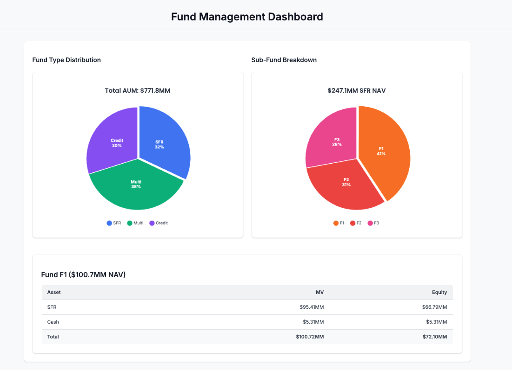

# React Fund Dashboard

## Overview

React Fund Dashboard is an interactive web application for visualizing and exploring investment fund data. This dashboard provides financial professionals with intuitive visualizations of Assets Under Management (AUM), fund type breakdowns, and detailed asset allocations.

The dashboard was designed to provide a modern, responsive interface that allows users to drill down from high-level fund-type overviews to specific asset details through an intuitive click-based navigation system.



## Features

- **Interactive Data Visualization**: Dynamic pie charts that respond to user selection
- **Multi-level Drill-down**: Navigate from fund types to specific sub-funds to individual assets
- **Responsive Design**: Optimized for both desktop and mobile viewing
- **Real-time Data Updates**: Charts and tables update instantly when selections change
- **Excel Data Integration**: Easily load fund data from Excel spreadsheets
- **Clear Data Presentation**: Well-formatted financial data with proper alignment and formatting

## Technology Stack

- **React**: Front-end UI library
- **Chart.js & react-chartjs-2**: Chart visualization
- **ExcelJS**: Excel file parsing
- **CSS3**: Custom styling for dashboard components

## Getting Started

### Prerequisites

- Node.js (version 14.x or higher)
- npm (version 6.x or higher)

### Installation

1. Clone the repository:
   ```bash
   git clone https://github.com/np2446/GUI-Project
   cd GUI-Project
   ```

2. Install dependencies:
   ```bash
   npm install
   ```

3. Start the development server:
   ```bash
   npm start
   ```

4. Open your browser and navigate to:
   ```
   http://localhost:3000
   ```

### Data Setup

The dashboard expects an Excel file with fund data at:
```
public/data/DummyDataSet.xlsx
```

Required Excel columns:
- FundType: Category of the fund (e.g., Equity, Fixed Income)
- Fund: Name of the specific fund
- Asset: Individual asset name
- MV: Market Value in millions
- Equity: Equity allocation in millions

## Project Structure

```
react-fund-dashboard/
├── public/
│   ├── data/
│   │   └── DummyDataSet.xlsx       # Excel data file
│   └── index.html                  # Main HTML file
├── src/
│   ├── components/
│   │   ├── PieChart.js             # Reusable pie chart component
│   │   └── FundDetails.js          # Fund details table component
│   ├── utils/
│   │   └── dataLoader.js           # Excel data loading utilities
│   ├── App.js                      # Main application component
│   ├── index.js                    # Application entry point
│   └── index.css                   # Global styles
└── README.md                       # This documentation
```

## Usage

1. **View Fund Type Distribution**: The main pie chart shows the distribution of funds by type.
2. **Select a Fund Type**: Click on any segment of the main pie chart to view the sub-funds within that type.
3. **Explore Sub-Funds**: Click on a sub-fund in the second pie chart to see detailed asset breakdowns.
4. **Analyze Asset Details**: Review the detailed table showing all assets within the selected sub-fund.

## Customization

### Adding New Data

Replace the Excel file in `public/data/DummyDataSet.xlsx` with your own data file. Ensure it has the required columns mentioned above.

### Modifying Chart Appearance

Chart appearance can be customized in:
- `src/components/PieChart.js`: For chart-specific options
- `src/index.css`: For global styling

